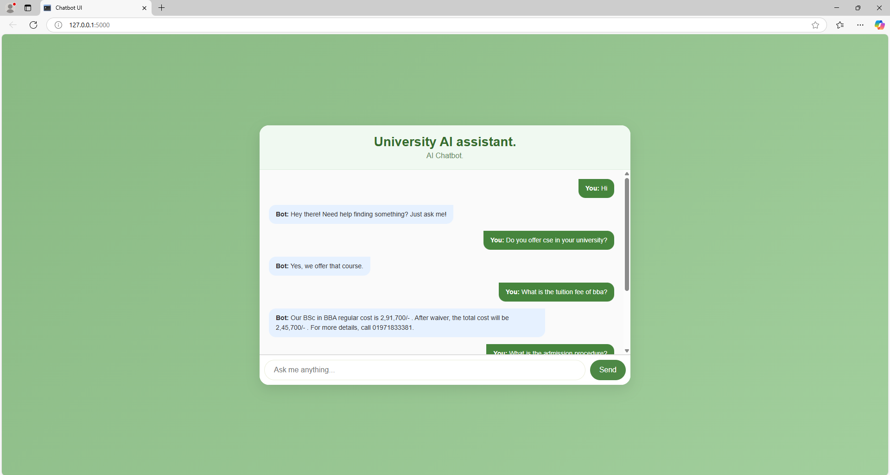

Chatbot for University Students

#Overview
This is a chatbot project designed to provide comprehensive solutions for students at my university.
The bot serves as an intelligent assistant, helping students with various queries related to university services,
academic information, course details, tuition details, academic details and other campus activities.

NOTE: You can customize and use this chatbot for any organization or personal use by changing the dataset and
      training it with your own custom data. This makes it versatile and adaptable to different contexts.

#Features

Student Query Handling: Answer frequently asked questions related to university details, courses, admissions and more.
Course Information: Provides details about available courses, faculty, and course schedules.
Support for Multiple Categories: Includes responses for general, academic, and administrative queries.

#Technologies Used

Python: The language for chatbot development.
Natural Language Processing (NLP): Utilized libraries like NLTK, text process for processing and understanding student queries.
Machine Learning Models:  Trained Neural Network models for question answering and intent recognition.
Flask/FastAPI: Framework used to deploy the chatbot as a web app.
HTML/CSS/JS: Frontend technologies for user interaction.

License
This project is licensed under the MIT License - see the LICENSE file for details.
